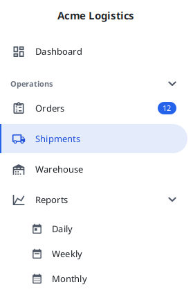

# fuin-fx

Hopefully useful JavaFX components

[](https://github.com/fuinorg/fuin-fx/actions/workflows/maven.yml)
[](https://sonarcloud.io/dashboard?id=org.fuin%3Afuin-fx)
[](https://central.sonatype.com/artifact/org.fuin/fuin-fx-navidraw)
[](https://www.gnu.org/licenses/lgpl.html)
[](https://openjdk.java.net/projects/jdk/25/)

## Versions

See [CHANGELOG.md](CHANGELOG.md) for the release notes.

## Navigation Drawer

A navigation drawer for JavaFX: a panel at the leading edge holding the application's top-level
destinations, beside the content on a wide window and above it on a narrow one, at full width or as an icon
only rail.

[](navidraw/doc/navigation-drawer.png)

For details see [navidraw](navidraw/).

## Modules

| Module                | Artifact                    | Description                                                                                                                                                                                                                |
|-----------------------|-----------------------------|----------------------------------------------------------------------------------------------------------------------------------------------------------------------------------------------------------------------------|
| [navidraw](navidraw/) | `org.fuin:fuin-fx-navidraw` | Navigation drawer: a panel with the application's top-level destinations, beside the content or above it, at full width or as an icon rail. Collapsible sections, sub menus, a selection model and a stylesheet of its own |
| jacoco                | -                           | Aggregates the coverage of all modules. Internal, not published                                                                                                                                                            |

Each module documents itself - see [navidraw/README.md](navidraw/README.md) for what the drawer does, how it
is styled and how to run its demo.

## Snapshots

Snapshots are published to the Central snapshot repository:

```xml

<repositories>
    <repository>
        <id>central.sonatype.snapshots</id>
        <name>Central Sonatype Snapshot Repository</name>
        <url>https://central.sonatype.com/repository/maven-snapshots/</url>
        <releases>
            <enabled>false</enabled>
        </releases>
        <snapshots>
            <enabled>true</enabled>
        </snapshots>
    </repository>
</repositories>
```

## Building

Requires JDK 25.

```bash
./mvnw -s settings.xml clean verify
```

The tests start the JavaFX toolkit for real but need no display: they run against JavaFX's own headless
Glass, selected with `glass.platform=Headless` in the `navidraw` module's surefire configuration.
