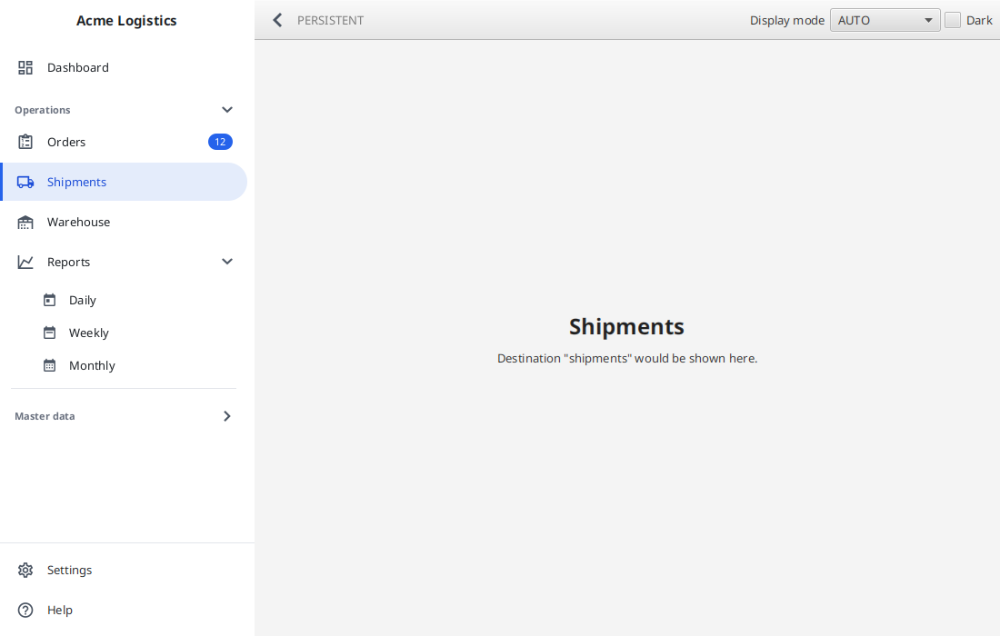
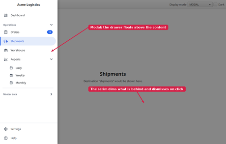
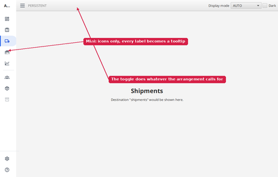
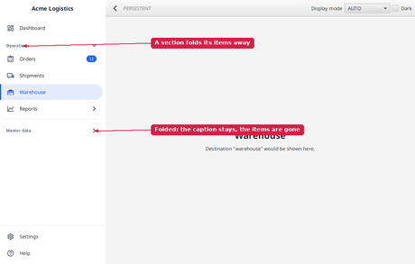
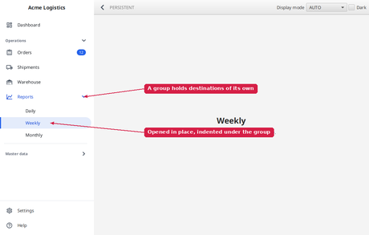
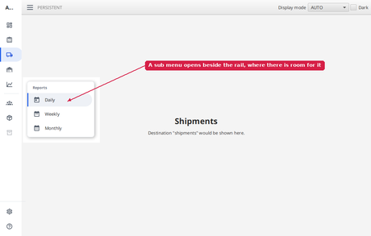
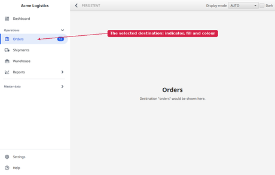
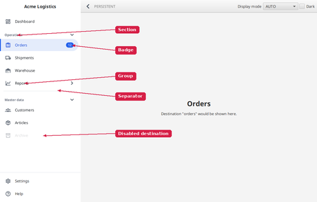
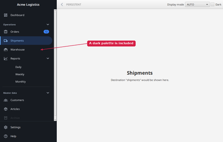

# fuin-fx-navidraw

A navigation drawer for JavaFX: a panel at the leading edge holding the application's top-level
destinations, beside the content on a wide window and above it on a narrow one, at full width or as an icon
only rail.

[](doc/navidraw.png)

*The demo: a persistent drawer with a collapsible "Operations" section, a "Reports" sub menu and a folded
"Master data" section. Run it yourself with the command under [Demo](#demo).*

```xml
<dependency>
    <groupId>org.fuin</groupId>
    <artifactId>fuin-fx-navidraw</artifactId>
    <version>1.0.0-SNAPSHOT</version>
</dependency>
```

```java
final NavigationDrawer drawer = new NavigationDrawer();
drawer.setHeader(new Label("Acme Logistics"));
drawer.getItems().addAll(
        new NavigationDestination("dashboard", "Dashboard", dashboardIcon()),
        new NavigationSection("Operations",
                new NavigationDestination("orders", "Orders", ordersIcon()),
                new NavigationGroup("Reports", reportsIcon(),
                        new NavigationDestination("daily", "Daily", dailyIcon()),
                        new NavigationDestination("weekly", "Weekly", weeklyIcon()))),
        new NavigationSeparator(),
        new NavigationSection("Master data",
                new NavigationDestination("customers", "Customers", customersIcon())));
drawer.getFooterItems().add(new NavigationDestination("settings", "Settings", settingsIcon()));

drawer.getSelectionModel().selectedItemProperty().addListener(
        (obs, old, selected) -> showPage(selected));

// Beside the content on a wide window, above it on a narrow one
final NavigationDrawerPane pane = new NavigationDrawerPane(drawer, content);

// Opens, closes, expands or collapses - whichever the current arrangement calls for
final DrawerToggleButton toggle = new DrawerToggleButton(pane);
```

The drawer also works on its own, for example in a `BorderPane`'s left slot, where it behaves as a permanent
panel. Everything the pane adds - the overlay, the scrim, the breakpoint - is optional.

## What it does

- **Persistent / modal**, switched automatically at `modalBreakpointProperty()` (900 pixels by default) or
  pinned with `displayModeProperty()`. Modal means the drawer floats above the content, dims it with a scrim
  and is dismissed by a click on the scrim or by `ESCAPE`, which also returns the focus where it was.
- **Expanded / mini**, through `sizeProperty()`. In the mini size labels and section captions disappear, the
  icons centre and every item offers its label as a tooltip.
- **Selection model** - a `SingleSelectionModel<NavigationDestination>` over the destinations of the main and
  the footer list, which follows its item when the lists change and clears itself when that item is removed.
- **Collapsible sections** - a `NavigationSection` owns the items under its caption and folds them away.
  See below.
- **Sub menus** - a `NavigationGroup` holds destinations of its own, opens and closes in place, and opens in
  a flyout beside the rail while the drawer is mini. See below.
- **Show and hide anything, at any time** - every item has a `visibleProperty()`, and hiding a group or a
  section hides everything inside it. See below.
- **Keyboard and screen readers** - items are focus traversable, react to `ENTER` and `SPACE`, and keep
  their full label as accessible text even while the drawer is mini.
- **Item kinds** - destination (with optional badge), group, section and separator.

Each picture below is a preview - click it for the full size version.

|  |  |  |
| :---: | :---: | :---: |
| [](doc/responsive.png)<br>**Persistent / modal** | [](doc/mini.png)<br>**Expanded / mini** | [](doc/sections.png)<br>**Collapsible sections** |
| [](doc/submenus.png)<br>**Sub menus** | [](doc/flyout.png)<br>**Sub menu on the mini rail** | [](doc/selection.png)<br>**Selection model** |
| [](doc/itemkinds.png)<br>**Item kinds** | [](doc/dark.png)<br>**Dark palette** |  |

## Sections

```java
final NavigationSection operations = new NavigationSection("Operations",
        new NavigationDestination("orders", "Orders", ordersIcon()),
        reportsGroup);
operations.setExpanded(false);          // starts folded
operations.setCollapsible(false);       // or: a plain heading that does not fold at all
```

A section owns the items under its caption rather than merely announcing them, which is what lets it fold
them. It holds destinations and groups, so a section cannot contain a section - one level of captions and
one level of sub menus below it, both enforced by the type of `getItems()` rather than by a rule someone has
to remember.

- **Open by default**, unlike a group, and collapsible by default. A section is not selectable: clicking the
  caption folds it, nothing else.
- **Selecting something inside a folded section opens it** - together with the group it may be nested in.
- **In the mini size the caption is hidden and the items are shown whatever the section says.** With no
  caption left to click there would be no way to get a folded section back, and those destinations would be
  stranded on the rail.

## Sub menus

```java
final NavigationGroup reports = new NavigationGroup("Reports", reportsIcon(),
        new NavigationDestination("daily", "Daily", dailyIcon()),
        new NavigationDestination("weekly", "Weekly", weeklyIcon()));
reports.setExpanded(true);
drawer.getItems().add(reports);
```

- **A group is not a destination.** Clicking it opens and closes its children and never changes the
  selection - there is no page behind a group, so a click that both navigated somewhere and expanded
  something would be two answers to one question.
- **Nesting is one level deep by construction**: `NavigationGroup.getItems()` holds
  `NavigationDestination`s, so a group cannot contain a group.
- **The children are ordinary destinations.** They appear in `drawer.getDestinations()` and in the selection
  model at the position the group sits, so the selection index and the visual order stay the same thing.
- **Selecting a child of a closed group opens it** - a selection nobody can see is worse than a group that
  opened by itself. A closed group whose child is selected is marked with the `:contains-selected`
  pseudo-class.
- **In the mini size the children open in a flyout** beside the rail rather than expanding in place, since
  an indented sub-tree has nowhere to go on a 64 pixel rail. The flyout is a `Popup`, so it has a scene of
  its own; it copies the application's stylesheets over, which is why the dark palette reaches it too.

## Showing and hiding items

Every item kind inherits `visibleProperty()` from `NavigationItem`, so anything can be shown or hidden at
any time - typically to match the signed-in user's permissions:

```java
orders.setVisible(false);        // one destination
reports.setVisible(false);       // a group: its header and all of its children
operations.setVisible(false);    // a section: its caption, its destinations and the groups inside it
operations.setVisible(true);     // back again
```

- A hidden item is **unmanaged** as well, so it takes no space rather than leaving a gap behind.
- A hidden destination is **not selectable**. It drops out of `getDestinations()`, and so does everything
  inside a hidden group or section - a destination nobody can reach should not be reachable by
  `selectById(...)` either. Hiding the currently selected destination clears the selection.
- `findDestination(id)` finds destinations **whatever their visibility**, which is how you get hold of one
  to show it again.
- Hiding and showing a container does not touch what its children say about themselves: an item hidden in
  its own right stays hidden when its section is shown again.

## Styling

The drawer brings its own stylesheet, so it is styled without the application adding anything. Everything is
expressed through looked-up colours, so a different palette is a handful of lines and no copied rules:

```java
scene.getRoot().setStyle("-fx-navidraw-background: #1b2a41; -fx-navidraw-selected-background: #24405f;");
```

A dark palette is included:

```java
scene.getStylesheets().add(NavigationDrawer.darkStylesheet());
```

The full list of colours is documented at the top of
[navidraw.css](src/main/resources/org/fuin/fx/navidraw/navidraw.css). Widths are styleable too
(`-fx-expanded-width`, `-fx-collapsed-width`).

## Icons

Item graphics are plain nodes, so any icon library works and none is required. For
[Ikonli](https://kordamp.org/ikonli/) there is a shortcut - add `ikonli-javafx` and an icon pack yourself,
they are optional dependencies here:

```java
drawer.getItems().add(IkonliGraphics.destination("orders", "Orders", "mdi2c-clipboard-list-outline"));
```

## Not included

Groups inside groups (nesting is one level by design) and edge-swipe gestures.

## Demo

Run from the repository root:

```bash
./mvnw -s settings.xml -pl navidraw test-compile exec:exec@demo
```

Resize the window across 900 pixels to see the arrangement flip, use the toggle button, fold the
"Operations" and "Master data" sections, open the "Reports" sub menu in both the full and the mini size,
hover an item while the drawer is mini, and switch the palette with the check box.
